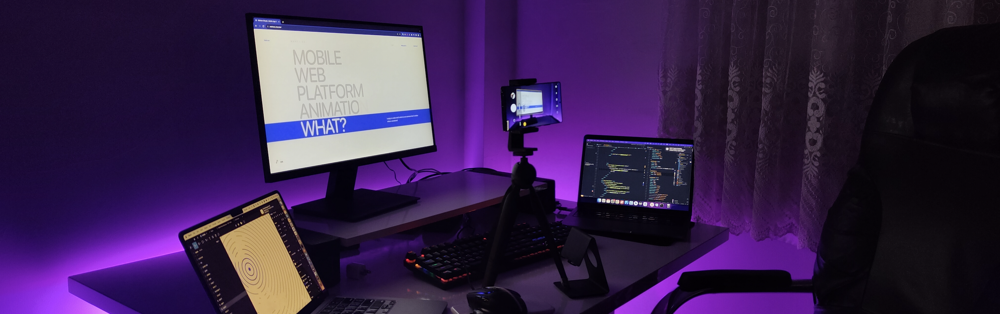

### Servus!

🌐 [**Visit**](https://mehran-port.web.app) 
🎯 DevOps | Cloud Security Enthusiast  

  

    
    
  

### Cloud  

  
    
  
    
  
  
  
  
    
  
    
   
  

### Web  

  
    
     
     
    
  
    
   
    
  
  

### Mobile  

  
    
    
    
    
    
  

